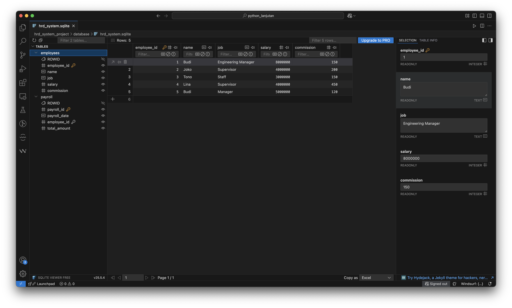
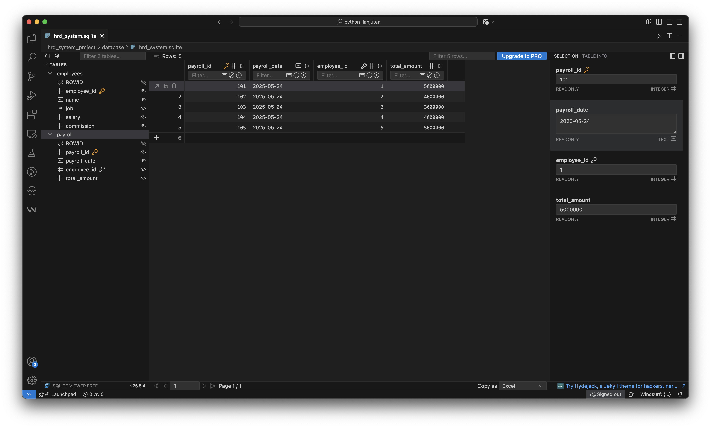

# MINI PROJECT HRD SYSTEM

Tech stack:
* python 3
* sqlite
* venv

## Getting Started
1. Install virtual environtment
    - Mac/linux: `python3 -m venv env`
    - Windows: `py -m venv env`

2. Install several visual studio extentions bellow:
    - SQLite by alexcvzz
    - SQLite3 Editor by yy0931
    - SQLite Viewer by Florian Klampfer

3. Create table `employees`. Run file `create_employee.py`
4. Create table `payroll`. Run file `create_payroll.py`
5. Insert data to table `employees`. Run file `insert_employee.py`
6. Insert data to table `payroll`. Run file `insert_payroll.py`
7. Try to update record `employees`. Run file `update_employee.py`
8. This script refactors the `payroll` table schema for better data integrity. It sets the `employee_id` column as a foreign key to the `employees` table. Please run the following to apply the change: `join_table_payroll_to_employees.py`

    ```
    FOREIGN KEY (employee_id) REFERENCES employees(employee_id)
    ```
<br>
<hr>

### Overview employees table


### Overview payroll table

