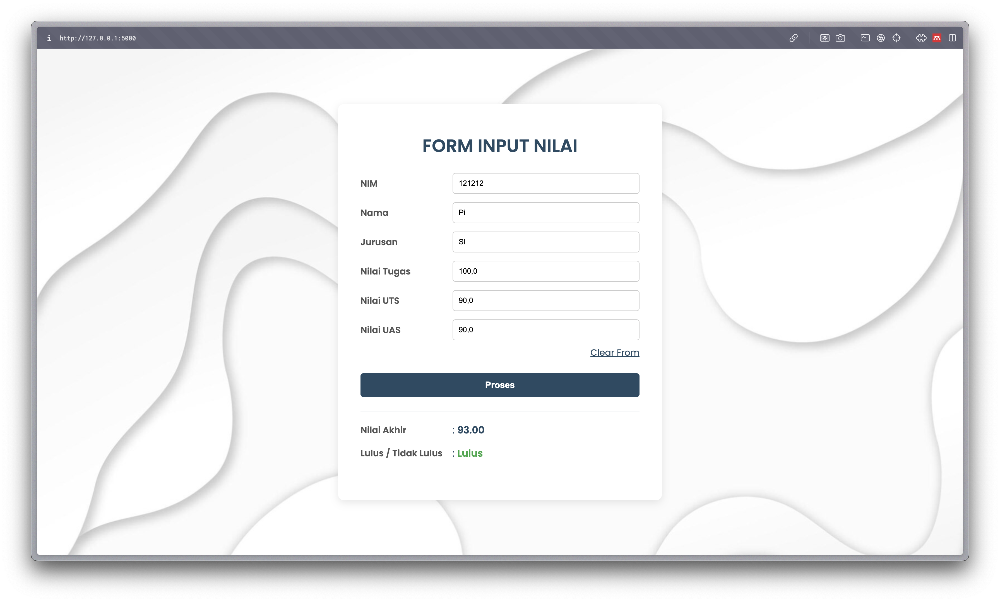
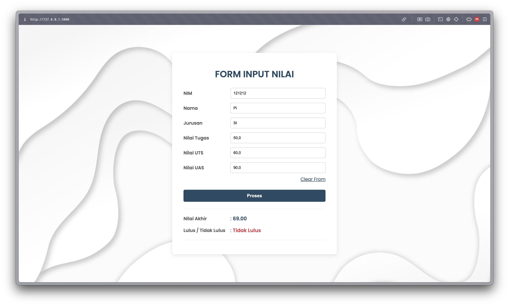

# Tech Stack
- pyhton 3
- flask
- virtual env
- some html and css

# Getting Started
1. install virtual environtment  
    `pip install virtualenv` 
    or 
    `pip3 install virtualenv`

2. create new env  
    `virtualenv myenv`

3. active env
    - windows: ` ./myenv/scripts/activate`
    - mac: `source ./myenv/bin/activate`

4. install flask
    - `pip install Flask`

5. if you got error permission denied then run command:
    - `Get-ExecutionPolicy`
    - `Get-ExecutionPolicy -Scope CurrentUser -ExecutionPolicy Unrestricted -Force`

6. run on your local machine
    - run `python3 main.py`
    - copy link local host on your browser
    - fill the form and see the result

## Preview lulus

## Preview tidak lulus

